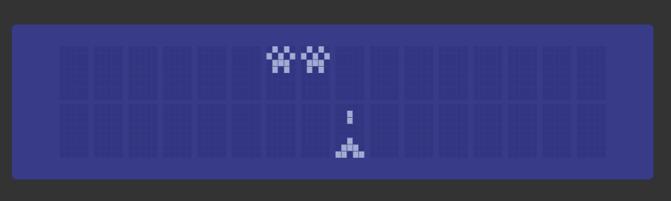
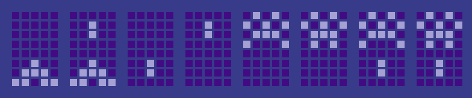

# Space-Invaders with Arduino

Space Invaders inspired game using an Arduino UNO, LCD character display, some
buttons and a buzzer. Enjoy it.

## How it works

We use some custom characters to represent the game objects.

With these characters we can draw the game objects on the LCD, that are:
space-ship, bullets and enemies(aliens). Each of these objects has a position on
screen.

- You score by number of enemies killed in each level.

- You can move the space-ship (left/right) with the buttons.

This project was implemented in C++ using the Arduino UNO as a microcontroller.

The code is available in simulated environment at Tinkercad:
[Space-Invaders](https://www.tinkercad.com/things/8VGYlNrX5pF)
